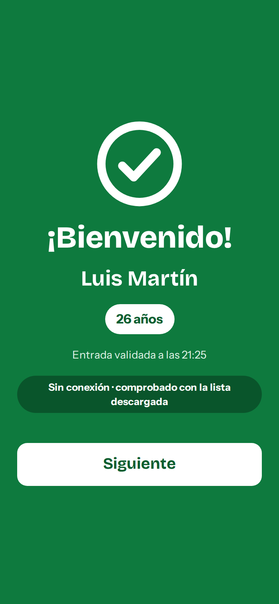

# QR event tickets

Replaces the Google Forms + Sheets + Apps Script setup with a small web app you own:

1. **Buy**: a mobile-first page where the attendee enters name, email and (only if the event needs it) birth date, gives GDPR consent and pays with Stripe (card, Apple Pay, Google Pay).
2. **Database**: Supabase Postgres with `events`, `orders`, `tickets` and `organizers`, locked down with Row Level Security.
3. **Ticket + email**: the Stripe webhook creates **exactly one** ticket per paid order, draws a PNG QR on the server that contains **only the ticket UUID**, and emails it through Resend.
4. **Check-in**: an installable PWA (`/checkin/`) for logged-in organizers. It scans with the camera and shows a full-screen **green "¡Bienvenido!"** or **red "Entrada ya utilizada" / "Entrada no válida"**, and keeps working with no signal.

All attendee and staff text is in Spanish.

| Compra | Escáner | Verde | Ya utilizada | No válida | Sin conexión |
|---|---|---|---|---|---|
|  |  |  |  |  |  |

Ticket email: [docs/screenshots/07-email.png](docs/screenshots/07-email.png)

## Stack (all managed, no server to run)

| Piece | Service | Why |
|---|---|---|
| Database, organizer login, server functions | **Supabase** (choose an EU region) | Postgres gives the atomic check-in and idempotent ticket creation; Auth handles organizer login; Edge Functions run the webhook. The free tier is enough for events under 1,000 attendees. |
| Payments | **Stripe Checkout** | Card, Apple Pay and Google Pay on a hosted page (no card data touches you), signed webhooks, instant test mode. |
| Email | **Resend** | Simple API, inline (CID) images for the QR, idempotency keys. Postmark is an equally good swap. |
| Static site | **Cloudflare Pages** (or Netlify) | Free, HTTPS (required for the camera), serves `web/` as is, with no build step. |

**Bizum:** Stripe doesn't offer Bizum. It needs a Redsys virtual POS from your bank. The code is ready for it: a second `redsys-webhook` function would verify the Redsys HMAC signature and call the same `fulfill_order()` function, so idempotency and email work unchanged (see "Next steps").

## How the requirements are met

| Requirement | Where |
|---|---|
| Ticket is created only after the payment is confirmed server-side | `supabase/functions/stripe-webhook`. The success page (`gracias.html`) creates nothing. |
| Webhook is idempotent | `fulfill_order()` locks the order row (`SELECT … FOR UPDATE`) and returns the existing ticket if the order is already paid. `tickets.order_id` is `UNIQUE`. Resend gets an `Idempotency-Key`. |
| Random, unguessable IDs | `tickets.id uuid default gen_random_uuid()` (UUID v4). |
| Atomic check-in | `check_in()` runs `UPDATE tickets SET checked_in_at = now() … WHERE id = $1 AND event_id = $2 AND checked_in_at IS NULL RETURNING name`. Tested with 20 simultaneous scans of one ticket: exactly 1 accepted. |
| Only organizers can check in | `check_in()` refuses anyone not in `organizers`. `anon` has no `EXECUTE` on it, and nobody has `UPDATE` on `tickets`. |
| QR generated on your server, ID only | `supabase/functions/_shared/qr.ts` (`qrcode` library). |
| Transactional email | `supabase/functions/_shared/deliver.ts` (Resend). |
| Low connectivity | See "Offline check-in" below. |
| GDPR | Consent checkbox (not pre-ticked) with a stored version and timestamp. Birth date only when the event needs it. Personal data lives only on the ticket. `anonymize_past_events()`. Staff phones get neither emails nor consent data, and wipe the list on logout. |

## Repository layout

```
supabase/
  migrations/20260924000000_init.sql   schema, RLS, create_order, fulfill_order, check_in, anonymize
  functions/create-checkout/           form → reserve place → Stripe Checkout URL
  functions/stripe-webhook/            Stripe → ticket → QR → email
  functions/_shared/                   env, QR, email template, delivery
  seed.sql                             example event + how to add an organizer
web/                                   static site (deploy this folder)
  index.html, assets/buy.js            purchase page
  gracias.html, privacidad.html        after-payment page, privacy policy TEMPLATE
  config.js                            Supabase URL + anon/publishable key (public by design)
  checkin/                             organizer PWA (app.js, sw.js, manifest, vendored libs)
tests/
  db/          SQL tests + concurrency test against a local Postgres
  functions/   Deno test of the webhook (bad signature, duplicate delivery, QR content)
  e2e/         Playwright test of the purchase page and the check-in PWA (online and offline)
```

## Setup, step by step

You need the [Supabase CLI](https://supabase.com/docs/guides/cli) and accounts on Supabase, Stripe and Resend. Everything below is in Stripe **test mode** first.

### 1. Supabase

1. Create a project in an **EU region** (e.g. Frankfurt or Paris).
2. In this folder: `supabase login`, then `supabase link --project-ref <your-ref>`, then `supabase db push` (this applies the migration).
3. **Authentication → Sign In / Providers → Email**: turn **off** "Allow new users to sign up". Organizers are created by you, never by strangers.
4. **Authentication → Users → Add user**: one user per door phone or staff member (email + password).
5. In the SQL editor, grant them check-in rights:
   ```sql
   insert into public.organizers (user_id)
   select id from auth.users where email in ('puerta1@tudominio.com', 'puerta2@tudominio.com');
   ```
6. Create your event (see `supabase/seed.sql`). Set `published` and `sales_open` to `true` to start selling. Prices are in cents.
7. (GDPR) **Database → Extensions**: enable `pg_cron`, then schedule the daily clean-up:
   ```sql
   select cron.schedule('anonymize-past-events', '0 4 * * *', $$select public.anonymize_past_events(30)$$);
   ```

### 2. Stripe

1. **Developers → API keys**: copy the secret key (`sk_test_…`).
2. **Developers → Webhooks → Add endpoint**: URL `https://<your-ref>.supabase.co/functions/v1/stripe-webhook`, events `checkout.session.completed`, `checkout.session.async_payment_succeeded`, `checkout.session.async_payment_failed`, `checkout.session.expired`. Copy the signing secret (`whsec_…`).
3. **Settings → Payment methods**: enable Card, Apple Pay and Google Pay. Disable delayed methods such as SEPA Direct Debit so every ticket is issued instantly. Stripe Checkout shows the wallets automatically on supported devices.

### 3. Resend

1. Add and verify your sending domain (SPF + DKIM DNS records). This is what keeps tickets out of spam.
2. Create an API key.

### 4. Secrets and functions

```bash
cp supabase/functions/.env.example supabase/functions/.env   # fill in the values
supabase secrets set --env-file supabase/functions/.env
supabase functions deploy create-checkout
supabase functions deploy stripe-webhook
```
`supabase/config.toml` deploys both without Supabase JWT verification. `create-checkout` is public (it only reserves a place), and `stripe-webhook` verifies Stripe's signature itself.

### 5. Website

1. Edit `web/config.js`: `SUPABASE_URL`, the **anon** or **publishable** key (never the service role key), your brand and organizer name.
2. Fill in every `[…]` in `web/privacidad.html` and have it reviewed. It's a template, not legal advice.
3. Cloudflare Pages → **Create → Upload assets** (or connect the repo) with **no build command** and output directory **`web`**. Put the resulting URL (or your custom domain) in `SITE_URL` and re-run `supabase secrets set`.
4. Link attendees to `https://your-site/?e=<event-slug>`. Without `?e=`, the page lists all published events.

### 6. Try it end to end

1. Buy a ticket with Stripe's test card `4242 4242 4242 4242` (any future date, any CVC).
2. Within seconds the ticket email arrives.
3. On a phone, open `https://your-site/checkin/`, log in as an organizer, pick the event, and use **Add to Home Screen** so it opens like an app.
4. Scan the email's QR (green), scan again (red, "ya utilizada"), then scan any other QR (red, "no válida").

Local webhook testing: `supabase functions serve --env-file supabase/functions/.env` plus `stripe listen --forward-to localhost:54321/functions/v1/stripe-webhook`.

## Offline check-in (poor signal at the venue)

- **Before doors open**, with good signal, open the event on every phone. The app downloads the event's ticket list (ID, name, birth date, check-in time) into IndexedDB. For 1,000 tickets that's well under 100 KB. It refreshes every 2 minutes while online.
- **Online**, every scan goes to `check_in()` in Postgres, the single source of truth, so two doors can never admit the same ticket.
- **When a request fails or takes more than 4 seconds**, the app switches to offline mode (amber "Sin conexión" pill). It validates against the local list, marks the ticket used on that phone, and queues the scan with its real time.
- **When signal returns** (checked every 15 s, or with the **Sincronizar** button), the queue is replayed with the original scan time. If another door had already admitted that ticket, it appears under **Incidencias** so you can follow up.
- **The trade-off:** while a phone is offline it can't know what other doors did in the meantime, so a copied QR could get in once at each offline door. With 1–3 doors, reduce the risk by:
  - bringing a 4G/5G hotspot or using the venue Wi-Fi for the door phones only;
  - if one door has no signal, sending all entries through that single door (one phone can't double-admit, because the local list catches it);
  - pressing **Sincronizar** right before doors open.
- Tickets bought after the last download show as "no válida (sin conexión)" with a hint to check again when online. Close sales a little before doors open, or refresh the list once you're at the venue.
- The app shell (HTML, JS, fonts, QR decoder) is cached by the service worker, so it reopens without signal. If the login session expires while offline, the phone keeps working from the local list and asks for the password once signal is back, without losing queued scans.
- **Buscar / código** finds a ticket by name or by the 8-character code printed under the QR, for broken screens or unreadable codes.

## GDPR notes

- **Data kept:** name and email always, birth date only when `collect_birth_date` is on (it is required when `min_age` is set). No DNI, no phone.
- **Consent:** an explicit, unticked checkbox. `consent_at` and `consent_version` (`CONSENT_VERSION` secret) are stored with the ticket. Bump the version when you change the policy text.
- **Single copy:** the order's personal fields are cleared when it's paid or expires. `anonymize_past_events(30)` blanks names, emails and birth dates 30 days after each event, and cleans abandoned orders.
- **Least privilege at the door:** organizers can read only `id, event_id, name, birth_date, checked_in_at`. Logging out wipes the phone's local list.
- **Processors:** sign or accept the DPAs of Supabase, Stripe and Resend, and list them in the privacy policy (the template already does).
- Fonts and libraries are self-hosted (no Google Fonts or CDN calls that leak visitor IPs).

## Tests

```bash
# Database: local Postgres 16 required (uses a disposable database "qr_test")
PGHOST=localhost PGUSER=postgres npm run test:db

# Webhook + QR + email (Deno 2)
npm run test:functions

# Browser tests of the purchase page and the check-in PWA (Chromium via Playwright)
npm install && npm run test:e2e
```

What they cover: idempotent fulfillment, amount mismatch, age limit, capacity and oversell, unpublished events, anonymous and non-organizer access denied, direct `UPDATE` denied, green/used/invalid/wrong-event results, offline scan times, anonymization, 20 concurrent scans of one ticket, bad Stripe signature, unpaid sessions, duplicate webhook (one email), QR decoding to exactly the ticket ID, HTML escaping in the email, and the whole door flow online and offline with sync and conflict detection.

## Next steps

- **Bizum through Redsys**: `redsys-webhook` function (verify `Ds_Signature` with HMAC-SHA256 3DES key, check `Ds_Response < 100`) → `fulfill_order()`.
- **Refunds**: handle `charge.refunded` and add `tickets.revoked_at`, which `check_in()` would treat as invalid.
- **Resend a ticket**: a small organizer-only function that clears `email_status` and calls `deliverTicket()`, for typos in email addresses.
- **Several tickets per purchase**: add `quantity` to `orders` and create one ticket per attendee name.
