# Recepció · Congrés Islàmic de Catalunya

App web per a l'equip de recepció: **escaneja el QR que ja reben els assistents** i diu al moment, a pantalla completa, si la persona **pot passar** (verd) o **no** (vermell: ja ha entrat, no ha pagat o codi no vàlid). Funciona amb el full de càlcul de sempre: llegeix «Assistència Pagada» i escriu a «Assistència».

- **App:** carpeta [`recepcio/`](recepcio/) — es publica sola a GitHub Pages: https://zaka-atm.github.io/qr-event-attendance/
- **Connexió amb el full:** [`apps-script/Codi.gs`](apps-script/Codi.gs) — instal·lació pas a pas a [`apps-script/LLEGEIX-ME.md`](apps-script/LLEGEIX-ME.md)
- **Mode demostració:** a la pantalla d'inici, «Provar-ho en mode demostració», amb codis QR de prova.

| Inici | Escàner | Pot passar | Ja ha entrat | No ha pagat | Cerca manual | Sense connexió |
|---|---|---|---|---|---|---|
| 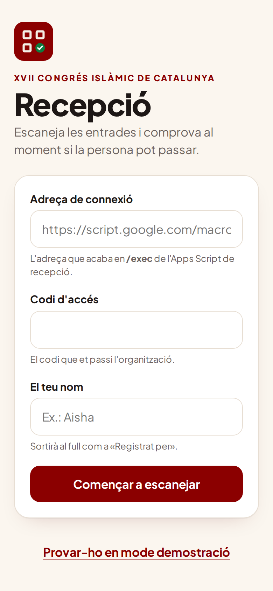 | 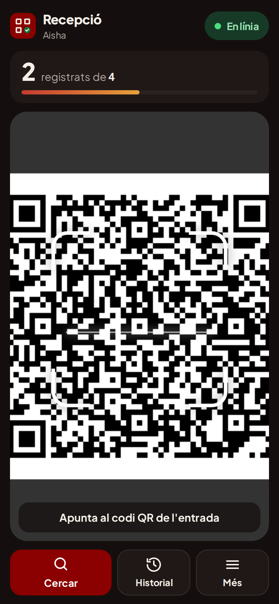 | 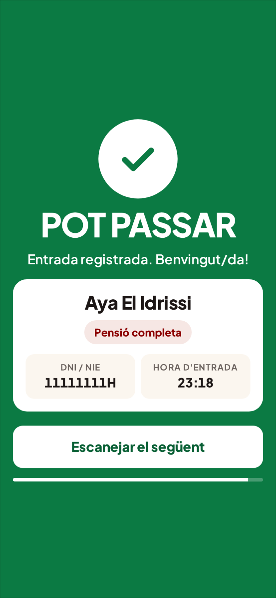 | 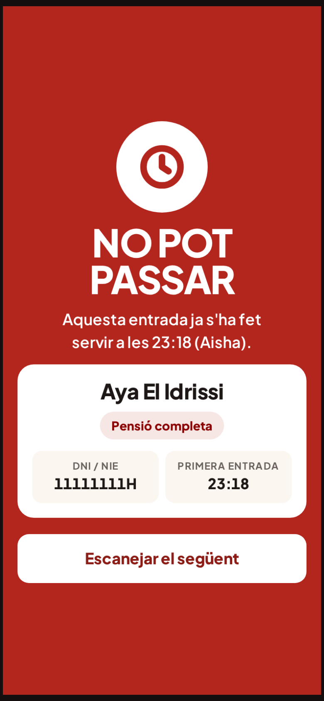 | 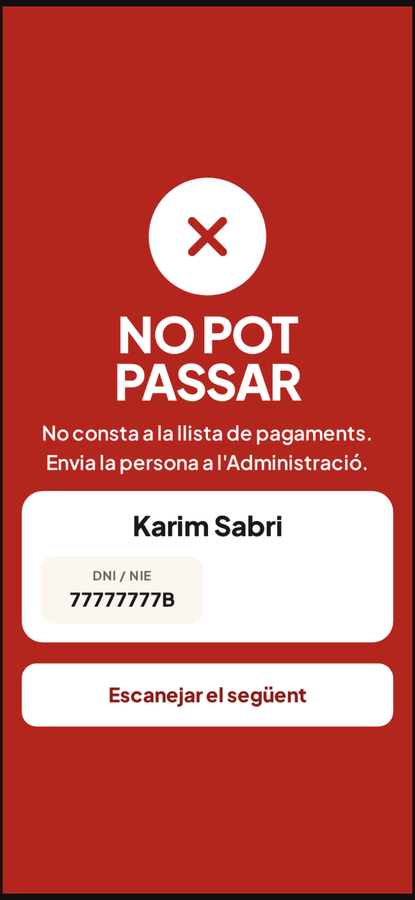 | 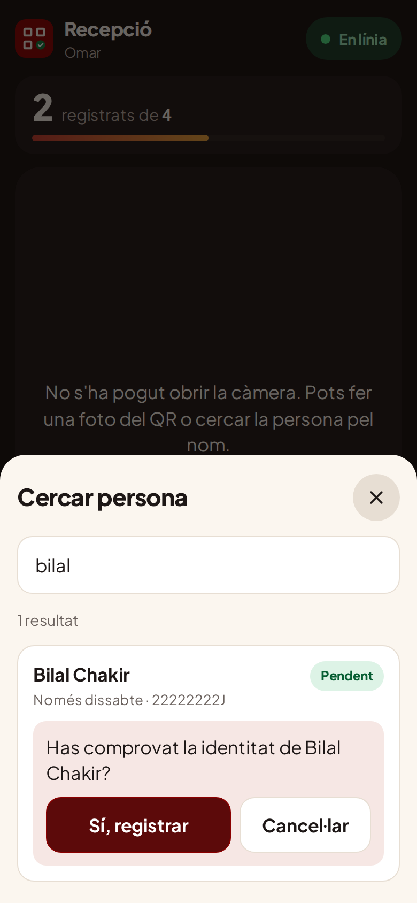 | 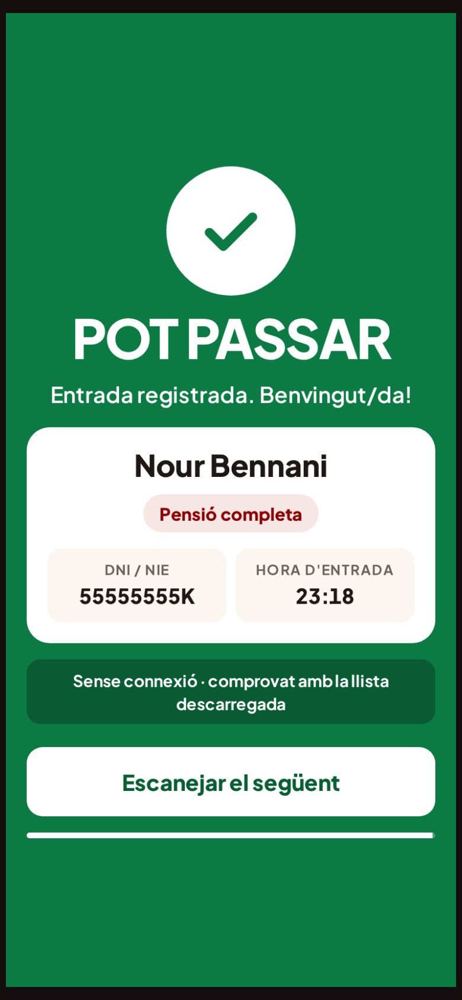 |

**Què fa:**
- Llegeix el QR del doGet (`…/exec?nom=…&dni=…&numero=…&tipusAsistencia=…`) amb la càmera, o d'una foto.
- Comprova el DNI contra «Assistència Pagada»: un QR inventat o d'algú que no ha pagat no passa.
- Registra a «Assistència» amb l'hora, **qui** l'ha registrat i **com** (QR, manual, sense connexió). Detecta també els registres fets amb el sistema antic.
- Si dues persones escanegen el mateix QR alhora, només una el registra (bloqueig a l'Apps Script).
- Cerca per nom o DNI per a qui no porta el QR.
- Sense cobertura: valida amb la llista descarregada (DNI amb hash, no en clar) i envia els registres quan torna la connexió.
- So i vibració diferents per a verd i vermell, llanterna, pantalla sempre encesa, s'instal·la a la pantalla d'inici.

**Proves:** `node tests/recepcio/backend.test.cjs` (Apps Script amb fulls simulats) i `npm install && node tests/recepcio/app.test.cjs` (navegador amb càmera simulada que mostra un QR).

---

## Sistema complet de venda d'entrades (versió anterior, opcional)


Sustituye el sistema de Google Forms + Sheets + Apps Script por una web propia:

1. **Compra**: el asistente pone nombre, email y (solo si el evento lo necesita) fecha de nacimiento, acepta la política de privacidad y elige **Bizum o transferencia**. Recibe una **referencia** (p. ej. `K7M2QX`) para poner en el concepto.
2. **Panel de pagos** (`/admin/`): tú compruebas el dinero en el banco y pulsas **Confirmar pago**. En ese momento se crea la entrada y se envía por email.
3. **Entrada y email**: el servidor genera un QR que contiene **solo el ID de la entrada** y lo envía con Resend.
4. **Puerta** (`/checkin/`): app para el móvil del equipo. Escanea con la cámara y muestra en verde **«¡Bienvenido!»** o en rojo **«Entrada ya utilizada»** / **«Entrada no válida»**. Funciona sin cobertura.

Todos los textos para asistentes y equipo están en español.

**Demo con datos de ejemplo:** https://claude.ai/artifact/8LQis7BvwFCMgXW2LqkTp4 (solo la puede abrir quien tenga acceso).

Para publicar la demo en tu propia dirección web:
- **GitHub Pages** (repositorio público, o privado con GitHub Pro): Settings → Pages → Source: **GitHub Actions**; después Actions → **Publicar demo** → **Run workflow**. La dirección aparece al terminar (`https://<usuario>.github.io/qr-event-attendance/`).
- **Cloudflare Pages** (gratis, vale con repositorio privado): Workers & Pages → Create → Pages → conectar el repositorio. Comando de build `node scripts/build-demo.mjs --static`, carpeta de salida `dist/demo`.
- En local: `node scripts/build-demo.mjs --static` y sirve `dist/demo/`.

| Compra | Reservada | Panel de pagos | Escáner | Verde | Ya utilizada | No válida |
|---|---|---|---|---|---|---|
| 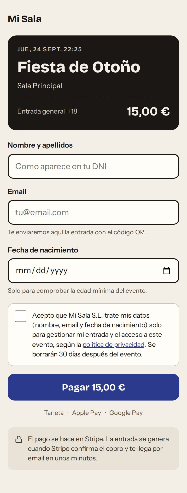 | 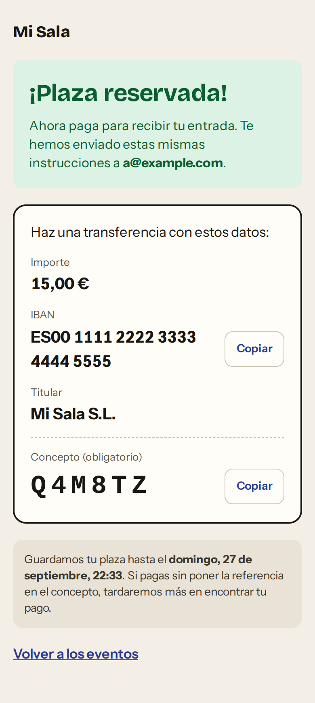 | 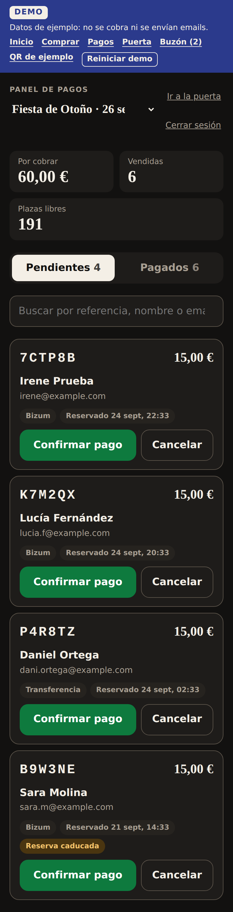 | 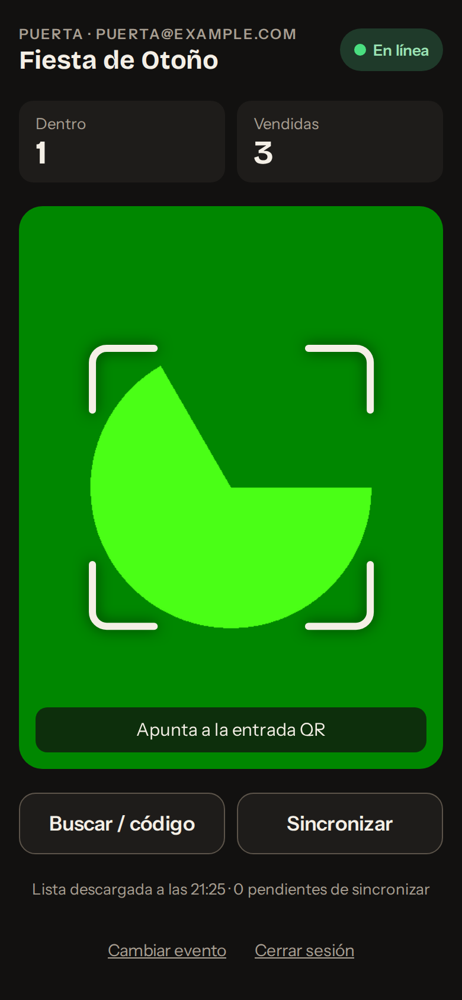 | 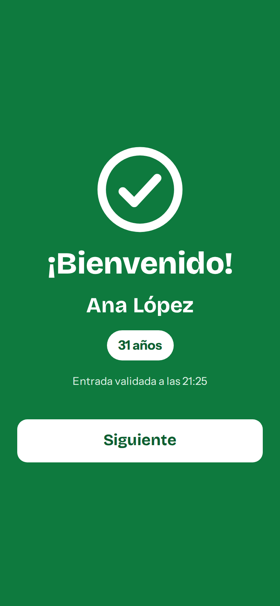 | 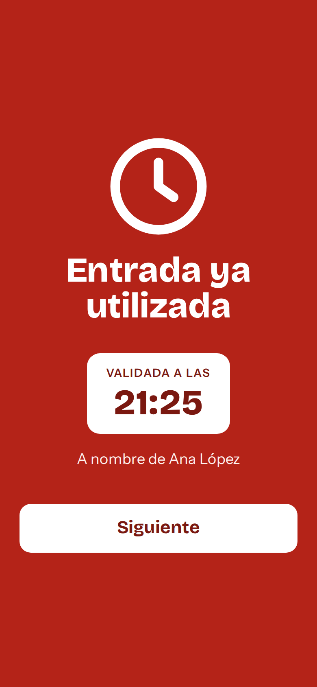 | 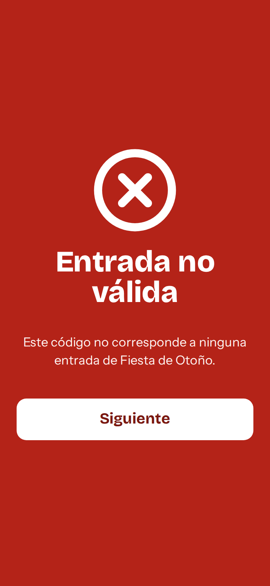 |

Email con la entrada: [docs/screenshots/07-email.png](docs/screenshots/07-email.png)

## Servicios (todos gestionados, sin servidor propio)

| Pieza | Servicio | Por qué |
|---|---|---|
| Base de datos, login de organizadores, funciones del servidor | **Supabase** (región UE) | Postgres garantiza que cada pedido da una sola entrada y que cada entrada entra una sola vez. El plan gratuito basta para eventos de menos de 1.000 personas. |
| Email | **Resend** | API sencilla, QR incrustado en el email y protección contra envíos duplicados. |
| Web | **Cloudflare Pages** (o Netlify) | Gratis, con HTTPS (necesario para la cámara). Se sube la carpeta `web/` tal cual. |

Los pagos se comprueban a mano: no hay pasarela ni comisiones. Si más adelante quieres cobro automático, se puede añadir Stripe o Bizum a través de Redsys sin cambiar el resto: bastaría con llamar a `confirm_order()` desde su webhook.

## Cómo se cumplen los requisitos

| Requisito | Dónde |
|---|---|
| La entrada solo existe cuando el pago está confirmado | `confirm_order()` en la base de datos, que exige ser organizador. El navegador del comprador solo puede reservar. |
| Confirmar dos veces no crea dos entradas | `confirm_order()` bloquea el pedido (`SELECT … FOR UPDATE`) y devuelve la entrada ya creada. `tickets.order_id` es `UNIQUE`. Probado con 10 confirmaciones simultáneas: una sola entrada. |
| IDs imposibles de adivinar | `tickets.id uuid default gen_random_uuid()` (UUID v4). |
| Check-in atómico | `check_in()`: `UPDATE tickets SET checked_in_at = now() … WHERE id = $1 AND event_id = $2 AND checked_in_at IS NULL RETURNING name`. Probado con 20 escaneos simultáneos: solo uno entra. |
| Solo organizadores validan y confirman | `check_in()`, `confirm_order()`, `cancel_order()` rechazan a quien no está en `organizers`. Nadie tiene permiso `UPDATE` directo. |
| QR generado en tu servidor, solo con el ID | `supabase/functions/_shared/qr.ts` (librería `qrcode`). |
| Email transaccional | `supabase/functions/_shared/resend.ts`. |
| Poca cobertura | Ver «Puerta sin cobertura». |
| RGPD | Ver «RGPD». |

## Estructura

```
supabase/
  migrations/20260924000000_init.sql   tablas, permisos, create_order, confirm_order, cancel_order, check_in…
  functions/create-order/              formulario → reserva → referencia e instrucciones (web + email)
  functions/manage-order/              panel: confirmar pago (crea y envía la entrada), cancelar, reenviar
  functions/_shared/                   QR, plantillas de email, envío con Resend
  seed.sql                             evento de ejemplo y cómo dar de alta organizadores
web/                                   la web (esto es lo que se publica)
  index.html, assets/buy.js            página de compra
  admin/                               panel de pagos
  checkin/                             app de la puerta (PWA)
  privacidad.html                      PLANTILLA de política de privacidad
  config.js                            URL de Supabase y clave pública
demo/                                  simulador para la demo (no se publica con la web real)
tests/                                 pruebas de base de datos, funciones y navegador
```

## Puesta en marcha

Necesitas la [CLI de Supabase](https://supabase.com/docs/guides/cli) y cuentas en Supabase y Resend.

### 1. Supabase
1. Crea un proyecto en una **región de la UE**.
2. En esta carpeta: `supabase login`, `supabase link --project-ref <tu-ref>`, `supabase db push`.
3. **Authentication → Sign In / Providers → Email**: desactiva «Allow new users to sign up». Los organizadores los creas tú.
4. **Authentication → Users → Add user**: un usuario por persona o móvil del equipo.
5. Dales permiso en el editor SQL:
   ```sql
   insert into public.organizers (user_id)
   select id from auth.users where email in ('puerta1@tudominio.com', 'caja@tudominio.com');
   ```
6. Crea tu evento (mira `supabase/seed.sql`). Precio en céntimos. Pon `published` y `sales_open` a `true` para abrir la venta.
7. (RGPD) **Database → Extensions**: activa `pg_cron` y programa la limpieza diaria:
   ```sql
   select cron.schedule('anonymize-past-events', '0 4 * * *', $$select public.anonymize_past_events(30)$$);
   ```

### 2. Resend
1. Añade y verifica tu dominio (registros SPF y DKIM). Así las entradas no acaban en spam.
2. Crea una API key.

### 3. Datos y funciones
```bash
cp supabase/functions/.env.example supabase/functions/.env   # rellena: teléfono Bizum, IBAN, Resend…
supabase secrets set --env-file supabase/functions/.env
supabase functions deploy create-order
supabase functions deploy manage-order
```

### 4. Web
1. Edita `web/config.js`: `SUPABASE_URL` y la clave **anon** o **publishable** (nunca la service role), tu marca y el nombre del organizador.
2. Completa todo lo que va entre `[…]` en `web/privacidad.html` y que lo revise tu asesor.
3. Cloudflare Pages → **Create → Upload assets** (o conecta el repositorio), **sin comando de build**, carpeta **`web`**. Pon la URL resultante en `SITE_URL` y repite `supabase secrets set`.
4. Enlace para vender: `https://tu-web/?e=<slug-del-evento>`. Sin `?e=` se listan todos los eventos publicados.

### 5. Día a día
- **Vender**: comparte el enlace. Cada reserva aparece en **Pagos** (`/admin/`) como pendiente, con su referencia.
- **Cobrar**: cuando veas el Bizum o la transferencia con esa referencia en el banco, pulsa **Confirmar pago**. La entrada sale por email al momento.
- **Reserva caducada** (por defecto a las 72 h, `RESERVATION_HOURS`): la plaza vuelve a contar como libre, pero todavía puedes confirmarla si queda aforo. Si el pago no llega, **Cancelar**.
- **Email equivocado**: en **Pagados**, **Reenviar entrada** con el email corregido.
- **En la puerta**: abre `/checkin/` en cada móvil, inicia sesión, elige el evento y añádela a la pantalla de inicio.

## Puerta sin cobertura

- **Antes de abrir puertas**, con buena señal, abre el evento en cada móvil. La app descarga la lista de entradas (ID, nombre, fecha de nacimiento, hora de entrada) y la guarda en el móvil. Para 1.000 entradas son menos de 100 KB. Se actualiza cada 2 minutos mientras hay conexión.
- **Con conexión**, cada escaneo va a la base de datos, así que dos puertas nunca dejan pasar la misma entrada.
- **Si la petición falla o tarda más de 4 segundos**, la app pasa a modo sin conexión (etiqueta ámbar «Sin conexión»). Valida con la lista del móvil y guarda el escaneo con su hora real.
- **Al volver la señal** (se comprueba cada 15 s, o con **Sincronizar**) se envían los escaneos guardados. Si otra puerta ya había dejado pasar esa entrada, aparece en **Incidencias**.
- **El inconveniente:** mientras un móvil está sin conexión no sabe lo que hacen las otras puertas, así que un QR copiado podría entrar una vez por cada puerta sin conexión. Con 1–3 puertas se evita:
  - llevando un router 4G/5G o usando el wifi del local solo para los móviles de la puerta;
  - si una puerta no tiene señal, haciendo entrar a todo el mundo por esa puerta (un solo móvil no deja pasar dos veces la misma entrada);
  - pulsando **Sincronizar** justo antes de abrir.
- Las entradas confirmadas después de la última descarga salen como «no válida (sin conexión)», con un aviso para comprobarlas cuando vuelva la señal. Deja de confirmar pagos un poco antes de abrir, o actualiza la lista al llegar al local.
- La app se abre sin conexión (el navegador guarda la aplicación). Si la sesión caduca sin conexión, sigue funcionando con la lista del móvil y pide la contraseña al volver la señal, sin perder los escaneos guardados.
- **Buscar / código** encuentra una entrada por nombre o por el código de 8 caracteres del email. **Leer QR de una foto** sirve si la cámara en directo falla.

## RGPD

- **Datos**: nombre y email siempre; fecha de nacimiento solo si el evento tiene `collect_birth_date` (obligatoria si hay `min_age`). Sin DNI ni teléfono.
- **Consentimiento**: casilla sin marcar. Se guardan `consent_at` y `consent_version` (secreto `CONSENT_VERSION`); cambia la versión cuando cambies el texto.
- **Un solo sitio**: al confirmar o cancelar, los datos del pedido se borran y quedan solo en la entrada. `anonymize_past_events(30)` borra nombres, emails y fechas 30 días después de cada evento y cancela las reservas abandonadas una semana después de caducar.
- **Mínimo en los móviles**: la puerta solo recibe ID, nombre, fecha de nacimiento y hora de entrada, nunca emails. El email solo se ve en el panel mientras el pedido está pendiente (para cuadrar el pago). Al cerrar sesión se borra la lista del móvil.
- **Encargados del tratamiento**: acepta los DPA de Supabase y Resend y menciónalos en la política de privacidad (la plantilla ya lo hace).
- Fuentes y librerías van incluidas en la web: no se llama a Google Fonts ni a CDN que puedan registrar la IP de los visitantes. La demo sí las carga de CDN; la web real no.

## Pruebas

```bash
PGHOST=localhost PGUSER=postgres npm run test:db     # Postgres 16 local; crea una base desechable "qr_test"
npm run test:functions                               # Deno 2
npm install && npm run test:e2e                      # navegador (Chromium con Playwright)
node scripts/build-demo.mjs && npm run test:demo     # recorrido completo de la demo
```

Cubren, entre otras cosas: reserva idempotente, edad mínima, aforo, reservas caducadas, accesos denegados a anónimos y no organizadores, 10 confirmaciones y 20 escaneos simultáneos, email de instrucciones y de entrada, QR que contiene exactamente el ID, reenvío a otro email, pantallas verde y rojas, modo sin conexión con sincronización e incidencias, y el panel de pagos.

## Siguientes pasos

- **Pago automático** (opcional): Stripe o Bizum vía Redsys llamando a `confirm_order()` desde su webhook.
- **Devoluciones**: añadir `tickets.revoked_at` para anular una entrada; `check_in()` la trataría como no válida.
- **Varias entradas por compra**: `quantity` en `orders` y una entrada por asistente.
